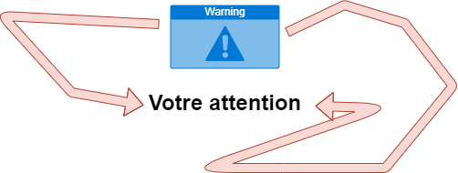

 
# 📘 Cours pour les Classes du Soir

Bienvenue sur le dépôt des supports de cours créés pour les étudiants (généralement) en première année pour les classes du soir! 🌙

## 📚 Objectif

Ces supports sont conçus comme un complément bref pour les étudiants découvrant les bases du réseau (Modèle OSI, TCP/IP, etc.). L'objectif est de fournir un aperçu rapide et simple pour faciliter l'apprentissage de la résolution de CTFs (Capture The Flags).

## 🎓 Contenu

Les cours abordent des notions essentielles tout en restant succincts. Ils ne sont pas parfaits, mais ils servent de guide rapide pour les aider à mieux appréhender les systèmes et les réseaux.

## 🚀 Apprentissage Actif

Notre approche encourage un apprentissage actif, où les étudiants sont encouragés à explorer et à appliquer ces connaissances dans des scénarios réels de CTFs et via des quiz.

## 💡 Remarque

Je suis réceptif à toute critique constructive, et je serais enchanté de recevoir des corrections en cas d'erreur.

