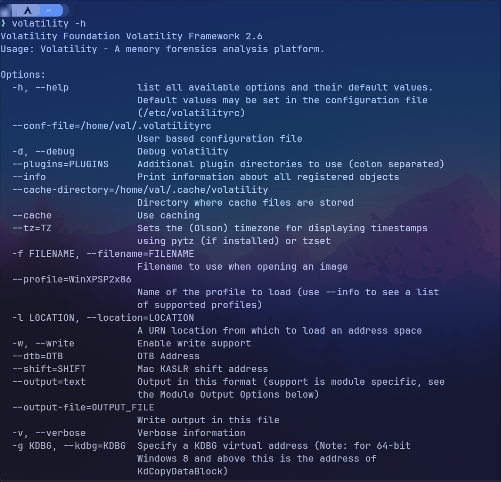

# Volatility

Volatility est un outil open source spécialisé dans l'analyse de la mémoire volatile des systèmes informatiques. Conçu principalement pour les enquêtes numériques et la cybersécurité, Volatility permet aux experts en informatique forensique d'extraire des informations cruciales à partir de l'état actuel de la mémoire RAM d'un système.

## Installation

```bash
wget http://downloads.volatilityfoundation.org/releases/2.6/volatility_2.6_lin64_standalone.zip
```

```bash
unzip volatility_2.6_lin64_standalone.zip
```

```bash
sudo ln -n volatility_2.6_lin64_standalone/volatility_2.6_lin64_standalone /usr/bin/volatility
```
## Utilisation

```bash
volatility -h
```



Tapez la commande vous même pour voir plus d'options.
